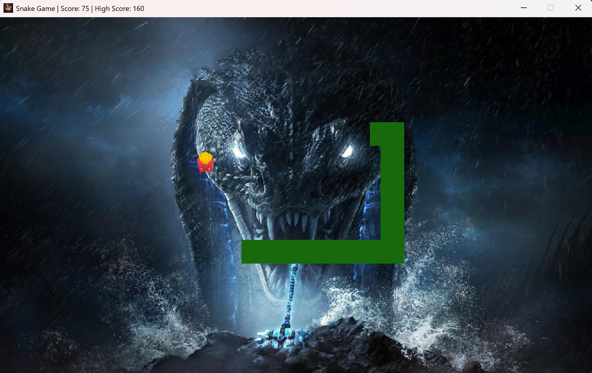
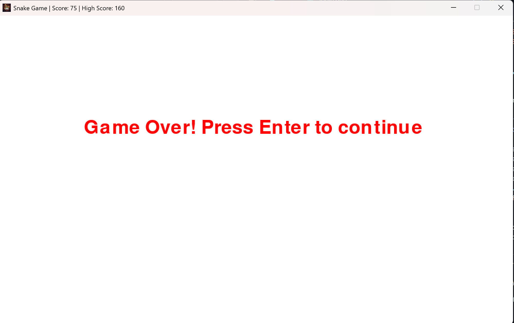

# 🐍 Snake Game

A modern **Snake Game** built with [Pygame](https://www.pygame.org/).  
Featuring smooth gameplay, sound effects, background music, and a high-score system! 🎮✨  

---

## 🎥 Preview



---

## 🚀 Features
- 🎵 **Background music** & immersive sound effects (eat, hit, game over).  
- 🏆 **High Score tracking** (stored locally in `resources/tmp/highScore.txt`).  
- 🍎 **Dynamic food spawning** (randomized positions).  
- ⚡ **Speed escalation** – game gets faster as your score increases.  
- 🎨 **Custom graphics** for snake, apple, and background.  
- 🖥️ Window title dynamically shows **current score & high score**.  
- 💀 Collision detection with walls & self.  

---

## 🛠️ Installation & Setup

### 1. Clone the repository
```bash
git clone https://github.com/aks1727/SnakeGame.git
cd SnakeGame
```

### 2. Install dependencies
Make sure you have **Python 3.8+** and `pygame` installed:
```bash
pip install pygame
```

### 3. Run the game
```bash
python main.py
```

---

## 🎮 Controls
| Key | Action |
|-----|---------|
| ⬆️ Up Arrow | Move Up |
| ⬇️ Down Arrow | Move Down |
| ⬅️ Left Arrow | Move Left |
| ➡️ Right Arrow | Move Right |
| ↩️ Enter | Restart after Game Over |
| ❌ Close Window | Quit Game |

---

## 📂 Project Structure
```
SnakeGame/
│── main.py                     # Game logic
│── resources/
│   ├── image/
│   │   ├── gameicon.png        # Window icon
│   │   ├── block.jpg           # Snake body block
│   │   ├── apple.png           # Food
│   │   └── bg.jpg              # Background
│   ├── sound/
│   │   ├── background_music.mp3
│   │   ├── eat.mp3
│   │   ├── hit.mp3
│   │   └── game_over.mp3
│   └── tmp/
│       └── highScore.txt       # Stores persistent high score
└── README.md
```

---

## 🏅 Scoring System
- Eating an apple: **+5 points**  
- Every **50 points** → Speed increases 🔥  
- High score persists between runs 🎯  

---

## 📌 To-Do / Future Enhancements
- [ ] Add **pause/resume functionality**  
- [ ] Difficulty levels (Easy, Medium, Hard)  
- [ ] Mobile-friendly version (with touch controls)  
- [ ] Online leaderboard 🌐  

---

## ❤️ Acknowledgements
Built with [Python](https://www.python.org/) and [Pygame](https://www.pygame.org/).  
Background music and sound effects are for demo purposes only.  

---

## 📜 License
This project is licensed under the **MIT License** – feel free to use and modify it.
